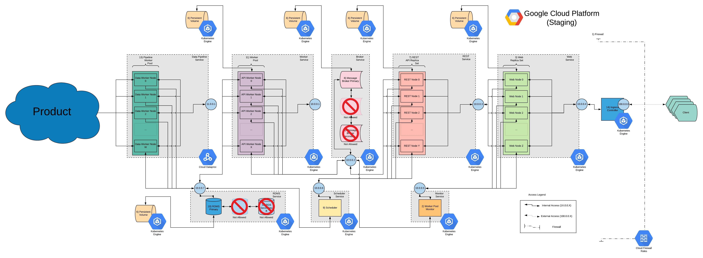
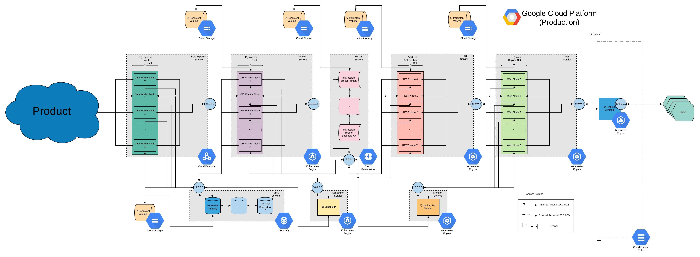

# Kubernetes Deployment on GCP
## Disclaimer

As of version 0.0.1 state-ful components such as the rdms service, and the broker service will require 
implementation of consideration #2. (mapping to Google Cloud) in order to achieve highly available services.

### Current Environment 



### Suggested Production Environment 



# Getting Started

All manifests are in ./k8s directory. It is suggested to login to Google Cloud Console and enable the Cloud Repo API in order to use the their hosted private repository feature. Once you have done so, use the `./*/cloudbuild.yaml` files to set up CI/CD using Cloud Build triggers. Make sure to point the build trigger to the Container Registry to make full use of rolling updates.

## Procedure

It is possible to rearrange some of the steps below. Follow these exactly and you should get an idea of the dependency at component level. You may then wish to automate this process in a slightly different order.

0. Create a project on Google Cloud Console. Navigate to the console here: https://console.cloud.google.com/ and get familiar with the interface by creating a project. If you get stuck refer to the documentation.

    * Use the console to create a new project.
    * If you do not have the `gcloud` CLI that comes with the Google Cloud SDK, download Google Cloud SDK. You can find the SDK here: https://cloud.google.com/sdk/
    * run 
    ```
    gcloud init
    ```
    and set up the default project so the `gcloud` SDK uses the project you just created by default.
    * Use `gcloud` CLI or console to activate GKE and create a cluster. For our purposes the a single node n1-standard-2 instance will suffice. Use default Kubernetes version currently `1.13.11-gke.14 (default)`
    * Using the GCP console, navigate to GKE. Once you have selected GKE > Clusters, find the cluster you just created and the "connect button" there should be a "Command-line access" with a kubectl command to copy and paste and execute in terminal. Mine is:
    ```
    gcloud container clusters get-credentials standard-cluster-1 --zone us-central1-a --project helpful-bunny
    ```
    When complete, type into the terminal:
    ```
    gcloud projects list
    ```
    if successful you should receive a response like:
    ```
    PROJECT_ID     NAME           PROJECT_NUMBER
    helpful-bunny  helpful-bunny  439045740211
    ```
    except with your project name in place of `helpful-bunny`.

    * You can verify step 0. is complete when you type in
    ```
    kubectl get services
    ```
    and get a terminal response like
    ```
    NAME         TYPE        CLUSTER-IP   EXTERNAL-IP   PORT(S)   AGE
    kubernetes   ClusterIP   10.0.0.1     <none>        443/TCP   7m54s
    ```
    *The `kubectl` command is the Kubernetes command line tool that comes packaged with the installation of `gcloud` SDK.*


1. Create persistent volume claims - PVs can be created first as they do not depend on any other pod/deployment, but pods/deployments may depend/require a PV to start up.
    * Navigate to `helpful-bunny-repo` project directory on your local machine. 
    * We require five (5) persistent volumes to set up the staging configuration. 
        1. RDMS PV (`./k8s/pvcs/rdms-pv-persistentvolumeclaim.yaml`) - Holds database files, and database server logs
        2. Worker PV (`./k8s/pvcs/worker-pv-persistentvolumeclaim.yaml`) - Holds worker logs
        3. Web PV (`./k8s/pvcs/web-pv-persistentvolumeclaim.yaml`) - Holds web server logs
        4. Broker PV (`./k8s/pvcs/broker-pv-persistentvolumeclaim.yaml`) - Holds broker logs
        5. REST PV (`./k8s/pvcs/api-pv-persistentvolumeclaim.yaml`) - Holds api server logs
    * In order to create PVs, from project directory type:
    ```
    kubectl create -f ./k8s/pvcs/*.yaml
    ```
    and you should receive a return message
    ```
    persistentvolumeclaim/** created
    ``` 
    where `*` is the name of the persistent volume claim `./k8s/pvcs/*.yaml` you want to create, and `**` is the name you gave the PV in `*.yaml`. Order of PV creation *DOES NOT* matter, simply ensure all PVs are created.

    When complete, type into the terminal:
    ```
    kubectl get pvc
    ```
    if successful you should receive a response like:
    ```
    NAME        STATUS   VOLUME                                     CAPACITY   ACCESS MODES   STORAGECLASS   AGE
    api-pv      Bound    pvc-7c7c6119-354a-11ea-9d28-42010a80004e   1Gi        RWO            standard       73s
    broker-pv   Bound    pvc-805a10b5-354a-11ea-9d28-42010a80004e   1Gi        RWO            standard       67s
    rdms-pv     Bound    pvc-8471c3c3-354a-11ea-9d28-42010a80004e   2Gi        RWO            standard       60s
    web-pv      Bound    pvc-88735fd0-354a-11ea-9d28-42010a80004e   1Gi        RWO            standard       53s
    worker-pv   Bound    pvc-8bfb2fc9-354a-11ea-9d28-42010a80004e   1Gi        RWO            standard       47s
    ```
    .

2. Create configuration maps - Configuration maps can be created next. They also do not depend on any pod/deployment but some pods/deployments may depend on a configuration map. A config map is like a `.env` file for pods' containers. They are used to set env vars for pods.
    * Navigate to `helpful-bunny-repo` project directory on your local machine. 
    * We require five (5) config maps to set up the staging configuration (broker and web Services have separate `conf` files and do not use ConfigMaps).
        1. RDMS ConfigMap (`./k8s/configmaps/rdms-rdms-rdms-env-configmap.yaml`) - Sets env vars for database containers
        2. Worker ConfigMap (`./k8s/configmaps/worker-multi-worker-env-configmap.yaml`) - Sets env vars for worker containers
        3. Scheduler ConfigMap  (`./k8s/configmaps/scheduler-multi-api-env-configmap.yaml`) - Sets env vars for web containers
        4. Monitor ConfigMap  (`./k8s/configmaps/monitor-multi-monitor-env-configmap.yaml`) - Sets env vars for broker containers
        5. REST ConfigMap  (`./k8s/configmaps/api-multi-api-env-configmap.yaml`) - Sets env vars for api containers

    * In order to create ConfigMaps, from project directory type:
    ```
    kubectl create -f ./k8s/configmaps/*.yaml
    ```
    and you should receive a return message
    ```
    configmap/* created
    ``` 
    where `*` is the name of the configuration map `./k8s/configmaps/*.yaml` you want to create, and `**` is the name you gave the ConfigMap in `*.yaml`. Order of ConfigMap creation *DOES NOT* matter, simply ensure all ConfigMaps are created.

    When complete, type into the terminal:
    ```
    kubectl get configmaps
    ```
    if successful you should receive a response like:
    ```
    NAME                        DATA   AGE
    api-multi-api-env           15     2m42s
    monitor-multi-monitor-env   5      2m16s
    rdms-rdms-rdms-env          2      2m9s
    scheduler-multi-api-env     15     119s
    worker-multi-worker-env     14     108s
    ```
    .


3. Create RDMS pod + RDMS service - The RDMS pod and RDMS service should be the first component of the system diagram created. 
    * Navigate to `helpful-bunny-repo` directory on your local machine.
    * We require 1, and only 1 RDMS pod running at all times. This *IS NOT* a highly available configuration, and so is only suitable to stage the API, UI, and Worker nodes for production. It is imperative that only a single RDMS pod be running else it will certainly corrupt the database files on the RDMS PV should two RDMS pods attempt to use the same PV. If you wish to run replicated RDMS services then use something like Cloud SQL. There is no deployment required for this pod since we *DO NOT* wish for the kubelet to maintain any number of RDMS pods. If the RDMS pods do go down they may likely not start, or start with the risk of corrupting the data. So, in this failure scenario manual intervention is required to restore this service st least in the staging environment configuration. 
        1. RDMS pod (`./k8s/pods/rdms-pod.yaml`) - Defines the RDMS "pod" (Collection of containers, PVs, etc.)

    * In order to create the RDMS pod, from project directory type:
    ```
    kubectl create -f ./k8s/pods/rdms-pod.yaml
    ```
    and you should receive a return message
    ```
    pod/rdms created
    ```
    . Wait a moment and run the following to check if pod is ready:
    ```
    kubectl get pods
    ```
    If you receive the following message you are ok to proceed (making sure 1/1 rdms pods are ready).
    ```
    NAME   READY   STATUS    RESTARTS   AGE
    rdms   1/1     Running   0          65s
    ```

    * In order to create the RDMS service (making the RDMS pod available to the outside world), from project directory type:
    ```
    kubectl create -f ./k8s/services/rdms-service.yaml
    ```
    and you should receive a return message
    ```
    service/rdms created
    ```

    When complete, type these two commands into the terminal 1):
    ```
    kubectl get pods
    ```
    if successful you should receive a response like:
    ```
    NAME                    READY   STATUS    RESTARTS   AGE
    rdms                    1/1     Running   0          2d21h
    ```
    , and 2):
    ```
    kubectl get services
    ```
    if successful you should receive a response like:
    ```
    NAME         TYPE        CLUSTER-IP    EXTERNAL-IP   PORT(S)    AGE
    kubernetes   ClusterIP   10.12.0.1     <none>        443/TCP    30m
    rdms         ClusterIP   10.12.6.138   <none>        5432/TCP   44s
    ```


4. Create Broker deployment + Broker service - The broker pod and broker service should be the first component of the system diagram created. 
    * Navigate to `helpful-bunny-repo` directory on your local machine.
    * We require 1, and only 1 broker pod running at all times. This *IS NOT* a highly available configuration, and so is only suitable to stage the API, UI, and Worker nodes for production. This reason is not as dangerous as with the RDMS pod since this broker act as a cache and is not expected to keep any data after restart by default. But more than 1 pod will have no effect as the API will only access a single redis instance (ip address). If you manage to proxy requests to a sentinel cluster then it could in theory work but that is not the intended configuration. 
        1. broker deployment (`./k8s/deployments/broker-pod.yaml`) - Defines container + restart policy for Broker pod

    * In order to create the broker deployment, from project directory type:
    ```
    kubectl create -f ./k8s/deployments/broker-deployment.yaml
    ```
    and you should receive a return message
    ```
    deployment.apps/broker created
    ```
    Wait a moment and run the following to check if pod is ready:
    ```
    kubectl get pods
    ```
    If you receive the following message you are ok to proceed (making sure 1/1 broker pods are ready).
    ```
    NAME                    READY   STATUS    RESTARTS   AGE
    broker-76d497b7-mcthj   1/1     Running   0          80s
    rdms                    1/1     Running   0          6m40s
    ```
    (*Notice we are creating a deployment here instead of a pod. The difference is that we have a restart policy associated with the broker container. A single container, with no restart or replication policy can be run as a pod. But a pod + restart/replication policy is called combined in what you would call a deployment.*)

    * In order to create the broker service (making the broker pod available to the outside world), from project directory type:
    ```
    kubectl create -f ./k8s/services/broker-service.yaml
    ```
    and you should receive a return message
    ```
    service/broker created
    ```

    When complete, type these two commands into the terminal 1):
    ```
    kubectl get deployments
    ```
    if successful you should receive a response like:
    ```
    NAME     READY   UP-TO-DATE   AVAILABLE   AGE
    broker   1/1     1            1           2d21h
    ```
    , and 2):
    ```
    kubectl get services
    ```
    if successful you should receive a response like:
    ```
    NAME         TYPE        CLUSTER-IP    EXTERNAL-IP   PORT(S)    AGE
    broker       ClusterIP   10.12.6.165   <none>        6379/TCP   14s
    kubernetes   ClusterIP   10.12.0.1     <none>        443/TCP    33m
    rdms         ClusterIP   10.12.6.138   <none>        5432/TCP   4m1s
    ```


*Now that the RDMS and Broker components are set up (with services) the API, and Worker Nodes will be able to reach the RDMS and Broker on startup. If API, and Worker Nodes cannot reach RDMS, and Broker (using their respective services), they will not start.*

4. Create remaining deployments - Once the RDMS and Broker components are up and running, and they have been assigned cluster-ips by creating their services, then you can proceed to in creating the remaining deployments.
    * Navigate to `helpful-bunny-repo` directory on your local machine.
    * Remaining deployments can be created in any order, although you should create the deployment first then create the service. A deployment makes sense without a service, but a service does not make any sense without a pod/deployment. *CREATE DEPLOYMENT THEN SERVICE FOR EACH*.
        1. REST Deployment (`./k8s/deployments/api-deployment.yaml`) - Defines container + restart policy for REST Node pods
        2. Monitor Deployment (`./k8s/deployments/monitor-deployment.yaml`) - Defines container + restart policy for Worker Monitor pods
        3. Scheduler Deployment (`./k8s/deployments/scheduler-deployment.yaml`) - Defines container + restart policy for Scheduler pods
        4. Web Deployment (`./k8s/deployments/web-deployment.yaml`) - Defines container + restart policy for Web Nodes pods
        5. Worker Deployment (`./k8s/deployments/worker-deployment.yaml`) - Defines container + restart policy for Worker Nodes pods

        * In order to create the remaining deployments follow a similar process as when creating the broker deployment, from project directory type:
        ```
        kubectl create -f ./k8s/deployments/*.yaml
        ```
        where `*` is the name of the deployment file `*.yaml`. You should receive a return message
        ```
        deployment.apps/** created
        ```
        where `**` is the name of the deployment set in `*.yaml`.

        * If you have completed the above steps properly then typing in the command:
        ```
        kubectl get deployments
        ```
        will return something like:
        ```
        NAME        READY   UP-TO-DATE   AVAILABLE   AGE
        api         1/1     1            1           3m47s
        broker      1/1     1            1           7m41s
        monitor     1/1     1            1           2m36s
        scheduler   1/1     1            1           3m2s
        web         1/1     1            1           3m31s
        worker      1/1     1            1           3m37s
        ```

4. Create remaining services - Once the RDMS and Broker components are up and running, and they have been assigned cluster-ips by creating their services, and all deployments have been created and their minimum pod requirements are met (with no crash loops), you can proceed in creating the remaining services for the deployments.
    * Navigate to `helpful-bunny-repo` directory on your local machine.
    * Remaining services can be created in any order, although you should create the deployment first then create the service.
        1. REST Service (`./k8s/services/api-service.yaml`) - Defines endpoint for REST Node pods
        2. Monitor service (`./k8s/services/monitor-service.yaml`) - Defines endpoint for Worker Monitor pods
        3. Web service (`./k8s/services/web-service.yaml`) - Defines endpoint for Web Nodes pods
        4. Worker service (`./k8s/services/worker-service.yaml`) - Defines endpoint for Worker Nodes pods

        * In order to create the remaining services follow a similar process as when creating the broker service, from project directory type:
        ```
        kubectl create -f ./k8s/services/*.yaml
        ```
        where `*` is the name of the service file `*.yaml`. You should receive a return message
        ```
        service.apps/** created
        ```
        where `**` is the name of the service set in `*.yaml`.

        * If you have completed the above steps properly then typing in the command:
        ```
        kubectl get services
        ```
        will return something like:
        ```
        NAME         TYPE           CLUSTER-IP     EXTERNAL-IP      PORT(S)          AGE
        api          ClusterIP      10.12.7.58     <none>           8000:32079/TCP   2m46s
        broker       ClusterIP      10.12.6.165    <none>           6379/TCP         18m
        kubernetes   ClusterIP      10.12.0.1      <none>           443/TCP          52m
        monitor      ClusterIP      10.12.2.141    <none>           5555/TCP         2m40s
        rdms         ClusterIP      10.12.6.138    <none>           5432/TCP         22m
        web          NodePort       10.12.12.104   <none>           8080:30538/TCP   2m33s
        worker       ClusterIP      10.12.13.49    <none>           8880/TCP         2m27s
        ```
(*Note that nay ip addresses assigned to services here are created by Google and are ephemeral meaning they change frequently, ex. on restart. Do not consider these to be static for testing purposes etc.*)

6. Create ingress controller - We wish now to create the ingress controller which will direct all incoming traffic to web service. In addition the ingress controller can be used to terminate SSL using using cert bot although that is not done here and will require a domain registered with a DNS provider (this can also be done though GCP but any DNS will do).
    * Navigate to `helpful-bunny-repo` directory on your local machine.
    1. Ingress Controller (`./k8s/ingresscontroller/ingress-controller.yaml`) - Exposes web nodes to the web.

    * In order to create the broker service (making the broker pod available to the outside world), from project directory type:
    ```
    kubectl create -f ./k8s/ingresscontroller/ingress-controller.yaml
    ```
    and you should receive a return message
    ```
    ingress.extensions/ingress-controller created
    ```

    When complete, type this commands into the terminal
    ```
    kubectl get ingresses
    ```
    if successful you should receive a response like:
    ```
    NAME                 HOSTS     ADDRESS           PORTS     AGE
    ingress-controller   *         107.178.254.228   80        59s
    ```


# Building on top of the current system

The typical task logic is as follows:


The task execution business logic is implemented is in Python 3.7 using Celery for task execution, and Django + DRF in order to provide a custom REST service around business logic. Like much in Python, the implementation occurs at high level by invoking methods of related class object. It assumed the user is familiar with Python 3.X.

* More on Django and associated documentation can be found here: https://www.djangoproject.com/
* More on D.R.F. and associated documentation can be found here: https://www.django-rest-framework.org/
* More on Celery and associated documentation can be found here: http://www.celeryproject.org/

## Deployment options

The target deployment environment is Kubernetes. Although, with the materials provided here it should be straight forward to implement the system in any environment that supports the Docker container runtime.
